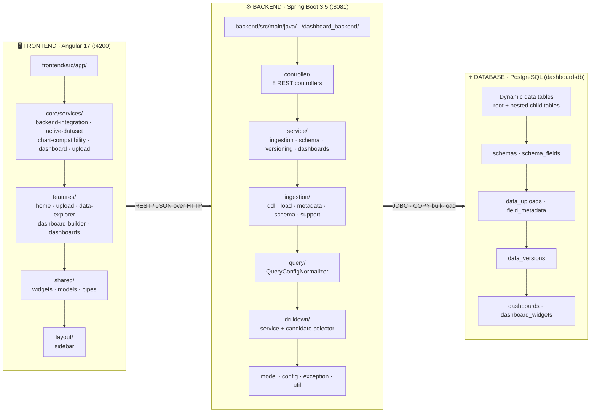
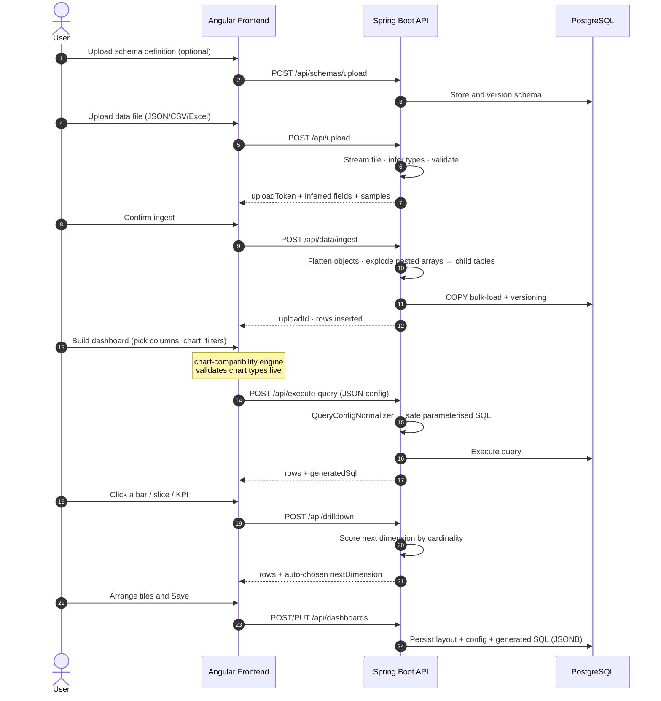

# Dynamic Dashboard Analytics Platform

A self-service, Power BI–style business-intelligence platform. Upload arbitrary **JSON / CSV / Excel** data, and the system automatically infers its schema, explodes nested JSON arrays into linked relational tables, and lets you build interactive, drill-down dashboards — **no SQL or code required**.

- **Frontend:** Angular 17 (standalone components) — `http://localhost:4200`
- **Backend:** Spring Boot 3.5 / Java 17 REST API — `http://localhost:8081`
- **Database:** PostgreSQL — `dashboard-db`

> 📄 A full technical deep-dive (architecture, API reference, data model, roadmap) is available in **`Dashboard_Project_Documentation.pdf`** in this folder.

---

## Table of Contents

1. [Architecture](#architecture)
2. [Application Workflow](#application-workflow)
3. [Tech Stack](#tech-stack)
4. [Prerequisites](#prerequisites)
5. [Setup & Run](#setup--run)
   - [1. Database (PostgreSQL)](#1-database-postgresql)
   - [2. Backend (Spring Boot)](#2-backend-spring-boot)
   - [3. Frontend (Angular)](#3-frontend-angular)
6. [Configuration Reference](#configuration-reference)
7. [API Overview](#api-overview)
8. [Project Structure](#project-structure)
9. [Troubleshooting](#troubleshooting)

---

## Architecture

The platform is a classic **three-tier** application. The browser never touches the database directly — every operation flows through the REST API.



### Tier responsibilities

| Tier | Technology | Responsibility |
|------|-----------|----------------|
| **Presentation** | Angular 17 | Renders all UI, parses files client-side (SheetJS), manages "active dataset" state, builds chart configs, calls the REST API. Holds no SQL logic — describes intent as JSON. |
| **Application** | Spring Boot 3.5 | All business logic: streaming ingestion, schema inference, dynamic DDL, config→SQL compilation, drill-down selection, versioning, dashboard persistence. |
| **Data** | PostgreSQL | Dynamically-created data tables (one root + N child tables per dataset) plus metadata tables. Nested-table topology is discovered live from `information_schema`. |

---

## Application Workflow

From a raw file on disk to an interactive drill-down chart:



**Key idea — config-as-contract:** the frontend never writes SQL. It describes *intent* ("group sales by region, sum revenue, top 10") as a JSON object, and the backend's `QueryConfigNormalizer` is the single authority that compiles it to safe, parameterised SQL — the same path used for live charts, previews, saved dashboards, and drill-downs.

---

## Tech Stack

| Layer | Technologies |
|-------|-------------|
| **Frontend** | Angular 17.3 · TypeScript 5.2 · RxJS 7.8 · Chart.js 4.4 · SheetJS (xlsx) 0.18 · SCSS |
| **Backend** | Java 17 · Spring Boot 3.5 (Web MVC + JDBC) · Apache Commons CSV · Jackson (streaming) · springdoc-openapi (Swagger) · spring-dotenv |
| **Database** | PostgreSQL 12+ (raw JDBC via `JdbcTemplate`, no ORM; `COPY` bulk-load) |
| **Build** | Maven (via `mvnw` wrapper) · Angular CLI / npm |

---

## Prerequisites

Install these before setup:

| Tool | Version | Check |
|------|---------|-------|
| **Java JDK** | 17+ | `java -version` |
| **PostgreSQL** | 12+ | `psql --version` |
| **Node.js** | 18+ (LTS) | `node -v` |
| **npm** | 9+ | `npm -v` |

> Maven is **not** required separately — use the bundled wrapper (`mvnw` / `mvnw.cmd`).

---

## Setup & Run

Run the three tiers in this order: **Database → Backend → Frontend**.

### 1. Database (PostgreSQL)

Create the database the backend expects (tables are created automatically at startup — you only need the empty database):

```bash
# Using psql (enter your postgres password when prompted)
psql -U postgres -c "CREATE DATABASE \"dashboard-db\";"
```

> The default connection is `jdbc:postgresql://localhost:5432/dashboard-db` with user `postgres`. Change these in `backend/src/main/resources/application.properties` if your setup differs.

### 2. Backend (Spring Boot)

The DB password is read from the `DB_PASSWORD` environment variable (via `spring-dotenv`). Create a **`.env` file** in the `backend/` folder:

```env
# backend/.env
DB_PASSWORD=your_postgres_password
```

Then start the API from the `backend/` folder:

```bash
cd backend

# Windows (PowerShell / CMD)
mvnw.cmd spring-boot:run

# macOS / Linux
./mvnw spring-boot:run
```

Verify it's up:

- Health check: <http://localhost:8081/hello> → `Hello World`
- Swagger UI: <http://localhost:8081/swagger-ui.html>

### 3. Frontend (Angular)

From the `frontend/` folder:

```bash
cd frontend

# Install dependencies (first time only)
npm install

# Start the dev server
npm start          # runs: ng serve
```

Open the app at **<http://localhost:4200>**. It proxies API calls to the backend at `http://localhost:8081/api`.

> ⚠️ **Corporate network note:** If `npm install` fails with **`EACCES`** on `registry.npmjs.org`, your network is blocking the public npm registry. Point npm at your organisation's internal registry first:
> ```bash
> npm config set registry https://<your-internal-registry-url>/
> npm install
> ```

---

## Configuration Reference

### Backend — `application.properties`

| Property | Default | Purpose |
|----------|---------|---------|
| `spring.datasource.url` | `jdbc:postgresql://localhost:5432/dashboard-db` | DB connection |
| `spring.datasource.username` | `postgres` | DB user |
| `spring.datasource.password` | `${DB_PASSWORD}` | From `.env` / environment |
| `server.port` | `8081` | API port |
| `app.cors.allowed-origins` | `${APP_CORS_ALLOWED_ORIGINS:http://localhost:4200}` | Allowed frontend origins (comma-separated) |
| `spring.servlet.multipart.max-file-size` | `100MB` | Max upload size |

### Frontend — `src/environments/environment.ts`

| Key | Default | Purpose |
|-----|---------|---------|
| `apiUrl` | `http://localhost:8081/api` | Backend REST base URL |
| `wsUrl` | `ws://localhost:8081` | WebSocket base (reserved for future streaming) |
| `defaultUserId` | `user_123` | Placeholder user (no auth yet) |

---

## API Overview

Base URL `http://localhost:8081`. Full interactive docs at `/swagger-ui.html`.

| Area | Key endpoints |
|------|--------------|
| **Upload / Ingest** | `POST /api/upload` · `POST /api/data/ingest` · `POST /api/data/ingest-with-schema` |
| **Datasets** | `GET /api/datasets` · `GET /api/datasets/{id}/rows` · `GET /api/datasets/{id}/tables` · `POST /api/datasets/{id}/aggregate` |
| **Query Engine** | `POST /api/generate-query` (preview) · `POST /api/execute-query` (run) |
| **Drill-Down** | `POST /api/drilldown` |
| **Schemas** | `POST /api/schemas/upload` · `GET /api/schemas` · `POST /api/schemas/{id}/validate` |
| **Versioning** | `POST /api/data/versions/check-duplicate` · `POST /api/data/versions/register` |
| **Dashboards** | `POST /api/dashboards` · `GET /api/dashboards` · `PUT /api/dashboards/{id}` · `DELETE /api/dashboards/{id}` |

---

## Project Structure

```
Dashboard Project/
├── backend/                     # Spring Boot 3.5 API (Java 17, Maven)
│   ├── src/main/java/com/example/dashboard_backend/
│   │   ├── controller/          # 8 REST controllers
│   │   ├── service/             # Business logic (ingestion, schema, versioning, dashboards)
│   │   ├── ingestion/           # Streaming pipeline: ddl · load · metadata · schema · support
│   │   ├── query/               # QueryConfigNormalizer (config → SQL)
│   │   ├── drilldown/           # Drill-down engine + cardinality selector
│   │   ├── model/               # DTO records
│   │   ├── config/              # OpenAPI + CORS
│   │   ├── exception/           # GlobalExceptionHandler
│   │   └── util/                # SqlIdentifier, VersioningUtil
│   ├── src/main/resources/application.properties
│   └── mvnw / mvnw.cmd / pom.xml
│
├── frontend/                    # Angular 17 SPA
│   └── src/app/
│       ├── core/services/       # backend-integration, active-dataset, chart-compatibility, ...
│       ├── features/            # home, upload, data-explorer, dashboard-builder, dashboards, ...
│       ├── shared/              # widgets, models, pipes
│       └── layout/              # sidebar
│
├── sample-data/                 # Example datasets + JSON schemas
├── test-files/                  # More sample data for manual testing
├── v_testing/                   # Data-versioning test cases
└── Dashboard_Project_Documentation.pdf   # Full technical documentation
```

---

## Troubleshooting

| Symptom | Cause | Fix |
|---------|-------|-----|
| `localhost:4200` → **ERR_CONNECTION_REFUSED** | Dev server not running / `node_modules` missing | Run `npm install` then `npm start` in `frontend/` |
| `npm install` fails with **`EACCES`** on `registry.npmjs.org` | Corporate network blocks public npm | Point npm at your internal registry (see [frontend setup](#3-frontend-angular)) |
| Backend won't start — DB connection error | PostgreSQL not running, DB missing, or wrong password | Start PostgreSQL, create `dashboard-db`, set `DB_PASSWORD` in `backend/.env` |
| Frontend loads but uploads/dashboards fail | Backend not running | Start the backend on `:8081` (see [backend setup](#2-backend-spring-boot)) |
| CORS errors in browser console | Frontend origin not allowed | Add your origin to `app.cors.allowed-origins` |
| `java -version` shows < 17 | Wrong JDK | Install JDK 17+ and set `JAVA_HOME` |

---

## Notes

- **Authentication is not yet implemented** — all actions use a placeholder `user_123`. Do not deploy to production without adding auth.
- Tables are created **automatically at first startup** (no manual migration step).
- The frontend `PROJECT_MANIFEST.md` describes an earlier design and does not match current code — this README and the PDF reflect the actual application.
